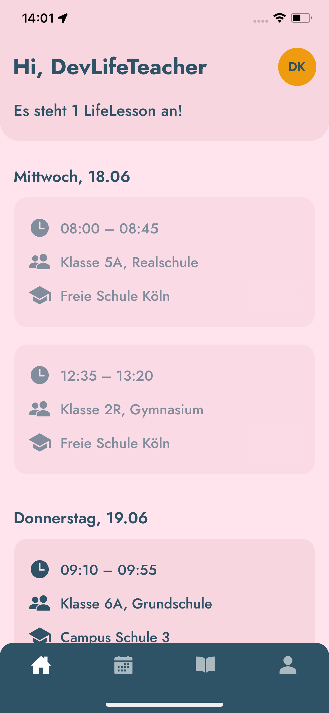
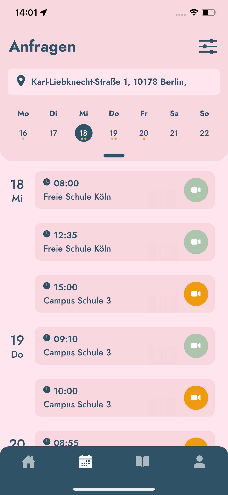
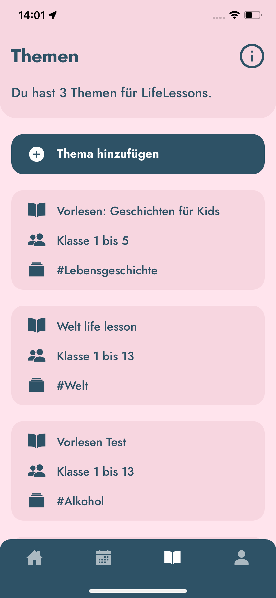

# LTU Notes App – Coding Challenge

Welcome to the LTU Notes App coding challenge! 🎯

This challenge is designed to simulate a realistic React Native development task within a simplified environment. You'll extend an existing app using AWS Amplify, Cognito, AppSync and Lambda. Please make yourself acquainted with the existing code structures and the current state of the app before you begin. 

---

## 🧠 Stack Overview

This app is built with the following technologies:

* **React Native** (Expo + TypeScript)
    * React context and reducer (State management)
    * React Navigation (Navigation)
* **AWS Amplify** (Gen1)

    * Cognito (Auth / User Pools)
    * AppSync (GraphQL)
    * DynamoDB
    * Lambda (used in Task 4)

---

## ✅ Prerequisites

To run the project successfully, you'll need:

* An **AWS account**

> If you don't have one, you can create a free account [here](https://aws.amazon.com/free/). 
> It takes about 5 minutes to set up.


* **Expo Go app** installed on your mobile device
* **Node.js v20** (recommended)
* **Yarn v1** (package manager)
* Amplify CLI installed globally:

```bash
npm install -g @aws-amplify/cli
```

---

## 🚀 Getting Started

1. **Fork the repository**
2. Clone your forked repository locally
3. Install dependencies:

```bash
yarn install
```

4. Initialize Amplify (choose "existing environment"):

```bash
amplify confgigure
amplify init
amplify push
```

5. Start the app:

```bash
yarn start
```

6. **In the AWS Console, create a Cognito user manually (email and password only) and set status to "CONFIRMED"**
7. Log in using your credentials from the login screen

---

## 📝 AI Guidelines

* You can use tools like **ChatGPT**, **GitHub Copilot** and the like,
* BUT please **document the following**:

    * What tools you used
    * Which parts you wrote / adapted / researched yourself
    * What you didn’t fully understand and just solved through AI

---

## ⏱ Time Frame & Expectations

* **Max duration: 4 hours**
* It’s okay if you don’t finish everything – but please leave notes in the code or a comment file to describe what you would’ve done next.
* There are **no wireframes** – use your best judgment and existing screens and styles as a base.

---

## 📸 What will I find in the app?

* Login and auth already implemented, including automatic password reset (Cognito status "force change password" is handled)
* Tab navigation with 3 tabs: Notizen, Archiv, Logout
* Notes are fetched in the background (but not shown yet)
* There might be other unused code snippets that could be useful for you

---

## ✨ Get some inspiration for your UI

<p>
  
  
  
</p>

---

## 🧩 Tasks

### 🧪 Task 1: Bugfixing

**Problem:** The app does not properly fetch notes after login.

**Estimated Time:** 15–30 minutes

> If you don't finish within 30 minutes, please reach out for the solution in order for you not to be blocked. WhatsApp: +49 175 59 69 411

---

### 🛠️ Task 2: List and create new notes

**Estimated Time:** 1.5–2 hours

**Your task:**

* Display a list of notes
* Add functionality to create new notes

---

### 📦 Task 3: Archive notes

**Estimated Time:** 1–1.5 hours

**Your task:**

* Add archive functionality to each note
* Show archived notes in a separate screen (the Archive tab)

---

### 🔬 Task 4: Lambda Word Count

**Estimated Time:** 45–60 minutes

**Your task:**

* Create a Lambda function which adds the word count of each note when it is created
* In the function, count the words in the note's content and update the note in DynamoDB
* Show the word count in the UI

---

## ✅ Submission Instructions

Once you’ve completed the challenge (or reached the 4-hour limit), please follow these steps:

1. **Grant me access to your GitHub repository (GitHub Account: mail@selinabrauns.com)**.
2. **Grant me access to your AWS backend** so I can test the functionality. Please make sure:
    - The Amplify backend is pushed (`amplify push`) and all necessary resources are deployed.
    - You share the following with me via email (selina@lifeteachus.org):
        - Your aws-exports.ts file
        - A **Cognito test user login** (username + password)  
          ⚠️ *Feel free to delete this user after the review is complete.*


Good luck and have fun! 🎉

